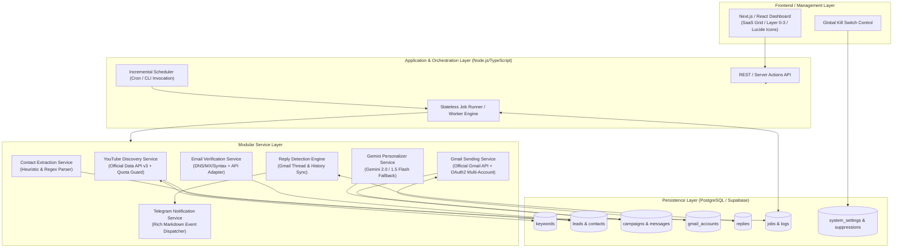

# System Architecture — LeadMiner / YouTube Lead Generation & Outreach Platform

**Document Version:** 1.0.0  
**Date:** 2026-09-15  
**System Status:** Phase 1 — Architecture & Asset Audit Completed  

---

## 1. Architectural Philosophy & Core Principles

The platform is designed around five non-negotiable principles:
1. **Reliability & Stateless Execution:** The backend process is stateless; all state, checkpoints, quotas, and job progress are persisted atomically in the PostgreSQL/Supabase database. The system survives abrupt restarts, network timeouts, and process terminations without duplicating work or losing keywords.
2. **Incremental Batch Processing:** The ~25,000 keyword corpus is processed in small, configurable batches (e.g., 5–25 keywords per batch). Quota is checked *before* executing each operation, stopping gracefully when daily quotas or budgets are reached.
3. **Strict Deduplication & Provenance:** Every lead is tied immutably to its discovery source keyword, timestamp, and raw payload. Channels are deduplicated globally on `channel_id`.
4. **Resilient Outreach Safety:** Multi-layered guards prevent duplicate sends: database constraints, campaign filters, suppression lists, daily account rate limits, and an immediate global Kill Switch.
5. **Clean Modular Service Layer:** External dependencies (YouTube Data API, Gmail API, Gemini API, Email Verification, Telegram Bot) are encapsulated behind abstract service interfaces, allowing testing, mock execution, and provider replacement without refactoring business logic.

---

## 2. High-Level System Architecture



---

## 3. End-to-End Workflow & Pipeline Stages

```text
[Keyword Taxonomy]
       ↓
[Batch Job Trigger] ──> Checks Daily YouTube Quota & Budget
       ↓
[YouTube API Search] ──> search.list(q=keyword) -> Extract channelIds
       ↓
[Channel Enrichment] ──> channels.list(id=channelIds) -> Title, subs, desc, views
       ↓
[Lead Extraction] ──> Deduplicate on channel_id; link source_keyword_id
       ↓
[Contact Discovery] ──> Regex & heuristic extraction (email, IG, Twitter, Discord, etc.)
       ↓
[Email Verification] ──> Format -> Syntax -> DNS MX check -> Provider verification
       ↓
[Lead Qualification] ──> Min subscribers, active uploads, valid email, not suppressed
       ↓
[Campaign Assignment] ──> Matches audience criteria, assigns template, sets daily cap
       ↓
[Personalization] ──> Template rendering + Optional Gemini AI custom hook (fallback safe)
       ↓
[Gmail Dispatcher] ──> Checks Kill Switch & account daily limit -> Sends via Gmail API
       ↓
[Reply Detection] ──> Periodic thread check -> Ingests reply -> Updates status
       ↓
[Telegram Alert] ──> Instant push notification for positive/meaningful creator replies
```

---

## 4. Component Deep Dive

### 4.1 Keyword Processing & Discovery Engine
- **Taxonomy Structure:** Preserves the 3-tier hierarchy recovered from `LeadMiner.xlsx`: `Category` (23) + `Entity` (2,786) + `Modifier` (302) -> 25,391 unique normalized keywords.
- **State Machine:**
  ```text
  PENDING ──> PROCESSING ──> COMPLETED (found channels > 0)
                 │         └─> SKIPPED (zero results / invalid)
                 ├──> RETRY (transient 5xx / rate limit)
                 └──> FAILED (terminal error after max attempts)
  ```
- **Concurrency & Batching:**
  - Configurable `BATCH_SIZE` (default: 10 keywords per run).
  - Atomic claim: `UPDATE keywords SET status = 'PROCESSING', last_attempt_at = NOW() WHERE id IN (SELECT id FROM keywords WHERE status IN ('PENDING', 'RETRY') AND attempt_count < max_attempts ORDER BY id ASC LIMIT :batchSize FOR UPDATE SKIP LOCKED)`.
- **Crash Recovery:** If a worker crashes mid-batch, stale `PROCESSING` keywords whose `last_attempt_at` exceeds a timeout threshold (e.g., 30 minutes) are automatically reset to `RETRY` on the next worker startup.

### 4.2 YouTube API Service & Quota Management
- **Endpoint Usage & Dual Quota Allocation:**
  - `search.list(part='snippet', q=keyword, type='channel', maxResults=15)`: Uses YouTube's dedicated search bucket of **100 calls/day** (1 unit per call).
  - `channels.list(part='snippet,statistics,brandingSettings', id=commaSeparatedIds)`: Costs **1 unit per call** (for up to 50 batched channel IDs) from the separate 10,000 general daily units pool.
- **Strict Dual-Bucket Quota Guard:**
  - Tracked in `system_settings` under key `youtube_quota`.
  - Maintains separate accounting: `search_calls_used_today` / `search_calls_daily_limit` and `general_quota_used_today` / `general_quota_daily_limit`.
  - Quota is calculated against Pacific Time midnight (when YouTube quotas reset automatically).
  - Before executing `search.list`, the engine verifies `search_calls_used_today < search_calls_daily_limit`. If exhausted, the job saves state, logs `QUOTA_REACHED`, and gracefully stops until the next day.
  - Channels are batched (up to 50 per `channels.list` call) to conserve the general quota pool.
- **Backoff & Rate Limiting:**
  - Exponential backoff with jitter on HTTP 429 / 503 errors (`baseDelay = 1000ms`, `maxDelay = 32000ms`, `factor = 2`).

### 4.3 Lead Extraction & Contact Discovery
- **Channel Deduplication:** `leads.channel_id` is unique. If a channel is discovered again from a different keyword, the system increments `appearance_count` or logs the secondary keyword association without duplicating the lead record.
- **Contact Extraction Pipeline:**
  - Regex patterns for email extraction with defensive filtering:
    - Eliminates false positives (`example.com`, `domain.com`, `support@youtube.com`, `noreply@...`, file extensions like `.png@...`).
  - Social handle extractors for Instagram (`instagram.com/handle`), Twitter/X (`x.com/handle`, `twitter.com/handle`), TikTok (`tiktok.com/@handle`), Discord (`discord.gg/...`), LinkedIn, and personal websites.
  - Gracefully records `email = NULL` when no public email is present.

### 4.4 Email Verification Service
- **Multi-stage Verification:**
  1. **Format Validation:** RFC 5322 compliance.
  2. **Disposable Domain Check:** Blocks known temporary mail domains (Mailinator, GuerillaMail, 10MinuteMail, etc.).
  3. **DNS MX Record Resolution:** Validates that the recipient domain has active mail exchanger records.
  4. **External Provider Adapter (Replaceable):** Abstract interface `IEmailVerifier` supporting adapters for Hunter, NeverBounce, ZeroBounce, or direct SMTP handshake.
- **State Enforcement:** Only leads with `email_status = 'VALID'` are eligible for outreach campaigns.

### 4.5 Gemini AI Personalization Engine (Optional with Fallback)
- **Model:** Gemini 2.0 Flash / Gemini 1.5 Flash via official `@google/genai` or `@google/generative-ai` SDK.
- **Authentication:** Ingests `GEMINI_API_KEY` from environment variables.
- **Input Context:** Channel title, subscriber count, recent video topics, channel description snippet.
- **Prompt Guard:** Formulates a single, highly relevant custom opening sentence or observation (e.g., referencing their specific content niche).
- **Resilience Rule:** If Gemini API times out, returns HTTP 429, or triggers content safety filters:
  - System logs `personalization_status = 'FALLBACK'`.
  - Reverts smoothly to the default base template line.
  - The campaign execution continues without interruption.

### 4.6 Gmail Sending Engine & Multi-Account Rotation
- **Protocol:** Official Google Workspace / Gmail REST API (`users.messages.send`) using OAuth2 Refresh Tokens.
- **Account Health & Rotation:**
  - Multiple configured sending accounts (`gmail_accounts` table).
  - Round-robin or weighted distribution.
  - Tracks `sent_today`, `daily_limit` (e.g. 25–50 sends/day per warm inbox), `last_send_at`.
  - Configurable send delay / jitter (e.g., 60–180 seconds between emails) to mimic natural human sending behavior.
- **Pre-Send Safety Checklist:**
  1. Global Kill Switch is **OFF**.
  2. Lead is not in `suppressions` table.
  3. Lead `outreach_status = 'PENDING'`.
  4. No message already sent to this `lead_id` (enforced via database uniqueness constraint).
  5. Account `sent_today < daily_limit`.
  6. Email is marked `VALID`.

### 4.7 Reply Detection & Telegram Notification Service
- **Detection Mechanism:**
  - Polling job runs periodically (e.g. every 15–30 minutes) querying Gmail threads initiated by the platform (`threads.get` or `messages.list(q="is:unread from:...")`).
  - Identifies incoming messages whose `threadId` matches an existing `messages.thread_id` and where sender != sending account.
- **Processing:**
  - Records the reply in the `replies` table.
  - Updates `leads.outreach_status = 'REPLIED'`.
  - Automatically pauses any pending sequence follow-ups for that lead.
- **Telegram Notification:**
  - Dispatches immediate alert via official Telegram Bot API (`sendMessage` with HTML/Markdown formatting).
  - Includes: Lead channel name, subscriber count, campaign name, sender email, reply snippet preview, and direct links to Gmail and Dashboard.
  - High-priority events only (no routine logs sent to Telegram).

### 4.8 Dashboard & User Interface
- **Design System:** Strict adherence to anti-AI product design rules:
  - **Color Stack:** Layer 0 canvas (`#0B0F17` dark / `#FFFFFF` light), Layer 1 elevated cards (`bg-white/[0.03]` with subtle border), Layer 2 recessed tables/inputs (`bg-black/40`), Layer 3 functional accents (indigo/emerald/rose).
  - **Vector Icons:** Lucide-react SVGs exclusively; zero OS emojis in UI elements.
  - **Numeric Alignment:** Numbers, subscriber counts, and rates right-aligned.
- **Key Modules:**
  - **Overview:** System status, pipeline metrics, quota gauge, kill switch status.
  - **Keywords:** Queue inspector, category filters, progress bar.
  - **Leads & Contacts:** High-density filterable data table with verification status badges.
  - **Campaigns & Templates:** Campaign creator, template editor with variable preview.
  - **Gmail Accounts:** Multi-inbox health, quotas, daily counters.
  - **Replies:** Unified inbox view.
  - **Jobs & Logs:** Execution telemetry, error inspectors.
  - **System Health & Kill Switch:** Visual connectivity indicators and the emergency STOP ALL button.

---

## 5. Failure Modes & Fault Tolerance Matrix

| Failure Scenario | Immediate System Reaction | Recovery Mechanism |
| :--- | :--- | :--- |
| **YouTube Quota Exhausted** | Catch 403 `quotaExceeded`, mark job `QUOTA_REACHED`. | Save exact keyword index; schedule pause until midnight PT reset; auto-resume next batch. |
| **Worker Process Crash / OOM** | OS terminates process. Current keyword stays `PROCESSING`. | On next boot, watchdog queries `status = 'PROCESSING' AND last_attempt_at < NOW() - INTERVAL '30 min'` and resets to `RETRY`. |
| **Network Timeout to YouTube/Gmail** | Request times out after 15s. | Exponential backoff retry (up to 3 attempts); if permanent, mark `FAILED` with error log and advance queue. |
| **Gemini API Error / Filter** | Catch exception, record `personalization_status = 'FALLBACK'`. | Immediate fallback to raw template. Campaign continues uninterrupted. |
| **Gmail Token Expired / Revoked** | Gmail API returns 401. | Attempt refresh token grant; if invalid, set `gmail_accounts.status = 'AUTH_ERROR'` and rotate to next available account. |
| **Emergency Halt (Kill Switch)** | Operator flips Kill Switch on Dashboard. | Atomic flag set in `system_settings`. Mailer worker checks flag before every single dispatch; halts immediately. |

---

## 6. Recommended Technology Stack

- **Runtime & Language:** Node.js (v20+ LTS) / TypeScript.
- **Frontend / Dashboard:** Next.js (App Router), Tailwind CSS, Lucide React.
- **Database & ORM:** PostgreSQL (Supabase or self-hosted) with Drizzle ORM or Prisma for type-safe schema definitions and migrations.
- **Background Jobs / Scheduler:** Node-based worker scripts with cron triggers (stateless, DB-driven, executable via CLI or scheduled task).
- **External SDKs:**
  - `googleapis` (Official Google API Client for YouTube Data API v3 and Gmail API v1).
  - `@google/genai` (Official Google GenAI SDK for Gemini 2.0 / 1.5 Flash).
  - `telegraf` or native `fetch` for Telegram Bot API.
