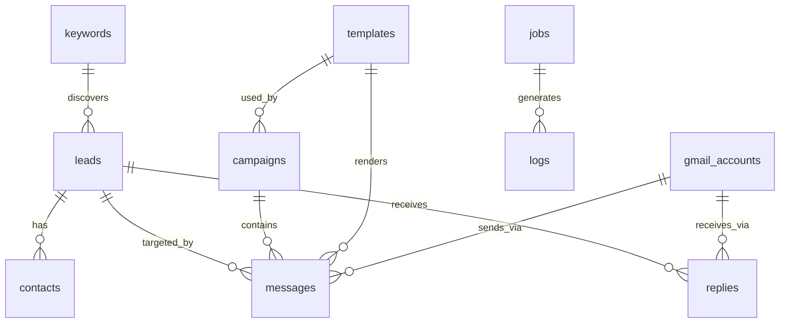

# Database Schema — LeadMiner / YouTube Lead Generation & Outreach Platform

**Database Engine:** PostgreSQL (Supabase Compatible)  
**Document Version:** 1.0.0  
**Date:** 2026-09-15  

---

## 1. Schema Design Overview

The database is normalized to 3NF, enforces referential integrity via foreign key constraints with explicit `ON DELETE` rules, utilizes indexes for high-throughput batch queries and deduplication, and records audit timestamps on every table.



---

## 2. PostgreSQL DDL Specification

### 2.1 Enumerations

```sql
-- Keyword execution statuses
CREATE TYPE keyword_status AS ENUM (
    'PENDING',
    'PROCESSING',
    'COMPLETED',
    'FAILED',
    'RETRY',
    'SKIPPED'
);

-- Lead qualification statuses
CREATE TYPE lead_qualification_status AS ENUM (
    'UNQUALIFIED',
    'QUALIFIED',
    'DISQUALIFIED'
);

-- Lead outreach lifecycle
CREATE TYPE lead_outreach_status AS ENUM (
    'UNPROCESSED',
    'QUEUED',
    'CONTACTED',
    'REPLIED',
    'BOUNCED',
    'UNSUBSCRIBED'
);

-- Contact email verification statuses
CREATE TYPE email_verification_status AS ENUM (
    'UNKNOWN',
    'VALID',
    'INVALID',
    'RISKY',
    'DISPOSABLE',
    'FAILED'
);

-- Campaign lifecycle
CREATE TYPE campaign_status AS ENUM (
    'DRAFT',
    'ACTIVE',
    'PAUSED',
    'COMPLETED',
    'STOPPED'
);

-- Outbound message statuses
CREATE TYPE message_send_status AS ENUM (
    'PENDING',
    'GENERATING',
    'READY',
    'SENDING',
    'SENT',
    'FAILED',
    'CANCELLED'
);

-- Personalization statuses
CREATE TYPE personalization_status AS ENUM (
    'NONE',
    'PENDING',
    'CUSTOMIZED',
    'FALLBACK',
    'FAILED'
);

-- Gmail account operational statuses
CREATE TYPE account_status AS ENUM (
    'ACTIVE',
    'PAUSED',
    'QUOTA_EXCEEDED',
    'AUTH_ERROR',
    'DISABLED'
);

-- Job execution statuses
CREATE TYPE job_status AS ENUM (
    'QUEUED',
    'RUNNING',
    'COMPLETED',
    'FAILED',
    'STOPPED_QUOTA'
);

-- Log severity levels
CREATE TYPE log_level AS ENUM (
    'DEBUG',
    'INFO',
    'WARN',
    'ERROR',
    'FATAL'
);
```

---

### 2.2 Core Tables

#### `keywords`
Stores the keyword taxonomy corpus imported from `LeadMiner.xlsx` and tracks execution state.

```sql
CREATE TABLE keywords (
    id BIGSERIAL PRIMARY KEY,
    keyword VARCHAR(500) NOT NULL,
    normalized_keyword VARCHAR(500) NOT NULL,
    category VARCHAR(255) NOT NULL,
    entity VARCHAR(255) NOT NULL,
    modifier VARCHAR(255) NOT NULL,
    status keyword_status NOT NULL DEFAULT 'PENDING',
    attempt_count INT NOT NULL DEFAULT 0,
    channels_found INT NOT NULL DEFAULT 0,
    last_attempt_at TIMESTAMPTZ,
    completed_at TIMESTAMPTZ,
    last_error TEXT,
    created_at TIMESTAMPTZ NOT NULL DEFAULT NOW(),
    updated_at TIMESTAMPTZ NOT NULL DEFAULT NOW(),
    CONSTRAINT uq_keywords_normalized UNIQUE (normalized_keyword)
);

CREATE INDEX idx_keywords_status_attempts ON keywords (status, attempt_count) WHERE status IN ('PENDING', 'RETRY');
CREATE INDEX idx_keywords_category ON keywords (category);
CREATE INDEX idx_keywords_last_attempt ON keywords (last_attempt_at);
```

---

#### `leads`
Stores discovered YouTube channels with full provenance.

```sql
CREATE TABLE leads (
    id BIGSERIAL PRIMARY KEY,
    channel_id VARCHAR(100) NOT NULL,
    channel_url VARCHAR(500) NOT NULL,
    channel_title VARCHAR(500) NOT NULL,
    custom_url VARCHAR(255),
    description TEXT,
    website VARCHAR(500),
    thumbnail_url VARCHAR(1000),
    subscriber_count BIGINT DEFAULT 0,
    video_count INT DEFAULT 0,
    view_count BIGINT DEFAULT 0,
    published_at TIMESTAMPTZ,
    source_keyword_id BIGINT REFERENCES keywords(id) ON DELETE SET NULL,
    qualification_status lead_qualification_status NOT NULL DEFAULT 'UNQUALIFIED',
    outreach_status lead_outreach_status NOT NULL DEFAULT 'UNPROCESSED',
    suppression_status BOOLEAN NOT NULL DEFAULT FALSE,
    discovered_at TIMESTAMPTZ NOT NULL DEFAULT NOW(),
    updated_at TIMESTAMPTZ NOT NULL DEFAULT NOW(),
    raw_payload JSONB,
    CONSTRAINT uq_leads_channel_id UNIQUE (channel_id)
);

CREATE INDEX idx_leads_qualification ON leads (qualification_status, outreach_status) WHERE suppression_status = FALSE;
CREATE INDEX idx_leads_subscriber_count ON leads (subscriber_count DESC);
CREATE INDEX idx_leads_source_keyword ON leads (source_keyword_id);
```

---

#### `contacts`
Stores extracted contact details (emails, social handles) linked to each lead.

```sql
CREATE TABLE contacts (
    id BIGSERIAL PRIMARY KEY,
    lead_id BIGINT NOT NULL REFERENCES leads(id) ON DELETE CASCADE,
    email VARCHAR(255),
    email_status email_verification_status NOT NULL DEFAULT 'UNKNOWN',
    verification_provider VARCHAR(100),
    verification_timestamp TIMESTAMPTZ,
    verification_reason TEXT,
    instagram VARCHAR(255),
    twitter VARCHAR(255),
    discord VARCHAR(255),
    tiktok VARCHAR(255),
    linkedin VARCHAR(255),
    other_social JSONB,
    created_at TIMESTAMPTZ NOT NULL DEFAULT NOW(),
    updated_at TIMESTAMPTZ NOT NULL DEFAULT NOW(),
    CONSTRAINT uq_contacts_lead_id UNIQUE (lead_id)
);

CREATE INDEX idx_contacts_email_status ON contacts (email_status) WHERE email IS NOT NULL;
CREATE INDEX idx_contacts_email ON contacts (email);
```

---

#### `templates`
Stores outreach email templates with variable substitution support.

```sql
CREATE TABLE templates (
    id BIGSERIAL PRIMARY KEY,
    name VARCHAR(255) NOT NULL,
    subject VARCHAR(500) NOT NULL,
    body TEXT NOT NULL,
    variables JSONB DEFAULT '["first_name", "channel_name", "channel_url", "subscriber_count", "custom_line"]'::jsonb,
    is_active BOOLEAN NOT NULL DEFAULT TRUE,
    created_at TIMESTAMPTZ NOT NULL DEFAULT NOW(),
    updated_at TIMESTAMPTZ NOT NULL DEFAULT NOW()
);
```

---

#### `campaigns`
Defines outreach campaigns, audience filters, limits, and active templates.

```sql
CREATE TABLE campaigns (
    id BIGSERIAL PRIMARY KEY,
    name VARCHAR(255) NOT NULL,
    status campaign_status NOT NULL DEFAULT 'DRAFT',
    template_id BIGINT REFERENCES templates(id) ON DELETE RESTRICT,
    daily_limit INT NOT NULL DEFAULT 50,
    min_subscribers BIGINT DEFAULT 1000,
    max_subscribers BIGINT DEFAULT 1000000,
    target_categories JSONB DEFAULT '[]'::jsonb,
    enable_gemini_personalization BOOLEAN NOT NULL DEFAULT FALSE,
    created_at TIMESTAMPTZ NOT NULL DEFAULT NOW(),
    updated_at TIMESTAMPTZ NOT NULL DEFAULT NOW()
);

CREATE INDEX idx_campaigns_status ON campaigns (status);
```

---

#### `gmail_accounts`
Maintains connected Gmail inboxes, daily sending quotas, and OAuth credentials.

```sql
CREATE TABLE gmail_accounts (
    id BIGSERIAL PRIMARY KEY,
    email VARCHAR(255) NOT NULL,
    status account_status NOT NULL DEFAULT 'ACTIVE',
    daily_limit INT NOT NULL DEFAULT 40,
    sent_today INT NOT NULL DEFAULT 0,
    last_send_at TIMESTAMPTZ,
    credential_reference VARCHAR(500) NOT NULL, -- Key in secret manager or encrypted store
    refresh_token TEXT,
    access_token TEXT,
    token_expires_at TIMESTAMPTZ,
    last_error TEXT,
    created_at TIMESTAMPTZ NOT NULL DEFAULT NOW(),
    updated_at TIMESTAMPTZ NOT NULL DEFAULT NOW(),
    CONSTRAINT uq_gmail_accounts_email UNIQUE (email)
);

CREATE INDEX idx_gmail_accounts_status_limit ON gmail_accounts (status, sent_today, daily_limit);
```

---

#### `messages`
Tracks individual outreach emails, rendered content, AI personalization, and Gmail message/thread IDs.

```sql
CREATE TABLE messages (
    id BIGSERIAL PRIMARY KEY,
    lead_id BIGINT NOT NULL REFERENCES leads(id) ON DELETE RESTRICT,
    campaign_id BIGINT NOT NULL REFERENCES campaigns(id) ON DELETE RESTRICT,
    gmail_account_id BIGINT REFERENCES gmail_accounts(id) ON DELETE SET NULL,
    template_id BIGINT REFERENCES templates(id) ON DELETE RESTRICT,
    recipient_email VARCHAR(255) NOT NULL,
    subject VARCHAR(500) NOT NULL,
    body TEXT NOT NULL,
    personalization_status personalization_status NOT NULL DEFAULT 'NONE',
    personalization_model VARCHAR(100),
    personalization_error TEXT,
    send_status message_send_status NOT NULL DEFAULT 'PENDING',
    sent_at TIMESTAMPTZ,
    message_id VARCHAR(255),
    thread_id VARCHAR(255),
    error TEXT,
    idempotency_key VARCHAR(255) NOT NULL,
    created_at TIMESTAMPTZ NOT NULL DEFAULT NOW(),
    updated_at TIMESTAMPTZ NOT NULL DEFAULT NOW(),
    CONSTRAINT uq_messages_lead_campaign UNIQUE (lead_id, campaign_id),
    CONSTRAINT uq_messages_idempotency UNIQUE (idempotency_key)
);

CREATE INDEX idx_messages_send_status ON messages (send_status);
CREATE INDEX idx_messages_thread_id ON messages (thread_id);
```

---

#### `replies`
Logs received replies from leads, matching them back to original threads and campaigns.

```sql
CREATE TABLE replies (
    id BIGSERIAL PRIMARY KEY,
    lead_id BIGINT NOT NULL REFERENCES leads(id) ON DELETE CASCADE,
    gmail_account_id BIGINT NOT NULL REFERENCES gmail_accounts(id) ON DELETE CASCADE,
    thread_id VARCHAR(255) NOT NULL,
    message_id VARCHAR(255) NOT NULL,
    sender_email VARCHAR(255) NOT NULL,
    snippet TEXT,
    received_at TIMESTAMPTZ NOT NULL,
    processed BOOLEAN NOT NULL DEFAULT FALSE,
    telegram_notified BOOLEAN NOT NULL DEFAULT FALSE,
    created_at TIMESTAMPTZ NOT NULL DEFAULT NOW(),
    CONSTRAINT uq_replies_message_id UNIQUE (message_id)
);

CREATE INDEX idx_replies_thread_id ON replies (thread_id);
CREATE INDEX idx_replies_unprocessed ON replies (processed) WHERE processed = FALSE;
```

---

#### `jobs`
Tracks execution lifecycle, state, progress, and errors of background tasks.

```sql
CREATE TABLE jobs (
    id BIGSERIAL PRIMARY KEY,
    job_type VARCHAR(100) NOT NULL, -- e.g. 'DISCOVERY_BATCH', 'SEND_CAMPAIGN', 'SYNC_REPLIES'
    status job_status NOT NULL DEFAULT 'QUEUED',
    parameters JSONB DEFAULT '{}'::jsonb,
    items_total INT DEFAULT 0,
    items_processed INT DEFAULT 0,
    items_failed INT DEFAULT 0,
    started_at TIMESTAMPTZ,
    completed_at TIMESTAMPTZ,
    last_heartbeat TIMESTAMPTZ,
    error TEXT,
    created_at TIMESTAMPTZ NOT NULL DEFAULT NOW(),
    updated_at TIMESTAMPTZ NOT NULL DEFAULT NOW()
);

CREATE INDEX idx_jobs_status ON jobs (status);
```

---

#### `logs`
Centralized application and telemetry event logs.

```sql
CREATE TABLE logs (
    id BIGSERIAL PRIMARY KEY,
    job_id BIGINT REFERENCES jobs(id) ON DELETE SET NULL,
    event_type VARCHAR(100) NOT NULL, -- e.g. 'API_REQUEST', 'LEAD_CREATED', 'MESSAGE_SENT'
    level log_level NOT NULL DEFAULT 'INFO',
    message TEXT NOT NULL,
    metadata JSONB DEFAULT '{}'::jsonb,
    created_at TIMESTAMPTZ NOT NULL DEFAULT NOW()
);

CREATE INDEX idx_logs_created_at ON logs (created_at DESC);
CREATE INDEX idx_logs_event_level ON logs (event_type, level);
```

---

#### `suppressions`
Global suppression / unsubscribe table preventing unwanted outreach.

```sql
CREATE TABLE suppressions (
    id BIGSERIAL PRIMARY KEY,
    email VARCHAR(255),
    channel_id VARCHAR(100),
    reason VARCHAR(255) NOT NULL DEFAULT 'UNSUBSCRIBED',
    source VARCHAR(100) NOT NULL DEFAULT 'OPT_OUT_LINK',
    created_at TIMESTAMPTZ NOT NULL DEFAULT NOW(),
    CONSTRAINT uq_suppressions_email UNIQUE (email)
);

CREATE INDEX idx_suppressions_channel ON suppressions (channel_id);
```

---

#### `system_settings`
Key-value store for global settings, kill switch, quota allocations, and pointers.

```sql
CREATE TABLE system_settings (
    key VARCHAR(100) PRIMARY KEY,
    value JSONB NOT NULL,
    description TEXT,
    updated_at TIMESTAMPTZ NOT NULL DEFAULT NOW()
);

-- Seed critical default settings
INSERT INTO system_settings (key, value, description) VALUES
('kill_switch', '{"enabled": false}'::jsonb, 'Global outreach kill switch. Set enabled=true to immediately halt sending.'),
('youtube_quota', '{"search_calls_daily_limit": 100, "search_calls_used_today": 0, "general_quota_daily_limit": 10000, "general_quota_used_today": 0, "last_reset_pt": "2026-09-15T00:00:00-07:00"}'::jsonb, 'YouTube API dual-bucket quota tracking (search.list 100 calls/day; general 10,000 units/day; resets midnight PT).'),
('batch_config', '{"keyword_batch_size": 10, "max_attempts": 3, "channel_limit_per_keyword": 15}'::jsonb, 'Discovery engine batch processing configuration.');
```

---

### 2.3 Automated Trigger for `updated_at`

```sql
CREATE OR REPLACE FUNCTION update_updated_at_column()
RETURNS TRIGGER AS $$
BEGIN
    NEW.updated_at = NOW();
    RETURN NEW;
END;
$$ LANGUAGE plpgsql;

CREATE TRIGGER trg_keywords_updated_at BEFORE UPDATE ON keywords FOR EACH ROW EXECUTE FUNCTION update_updated_at_column();
CREATE TRIGGER trg_leads_updated_at BEFORE UPDATE ON leads FOR EACH ROW EXECUTE FUNCTION update_updated_at_column();
CREATE TRIGGER trg_contacts_updated_at BEFORE UPDATE ON contacts FOR EACH ROW EXECUTE FUNCTION update_updated_at_column();
CREATE TRIGGER trg_templates_updated_at BEFORE UPDATE ON templates FOR EACH ROW EXECUTE FUNCTION update_updated_at_column();
CREATE TRIGGER trg_campaigns_updated_at BEFORE UPDATE ON campaigns FOR EACH ROW EXECUTE FUNCTION update_updated_at_column();
CREATE TRIGGER trg_gmail_accounts_updated_at BEFORE UPDATE ON gmail_accounts FOR EACH ROW EXECUTE FUNCTION update_updated_at_column();
CREATE TRIGGER trg_messages_updated_at BEFORE UPDATE ON messages FOR EACH ROW EXECUTE FUNCTION update_updated_at_column();
CREATE TRIGGER trg_jobs_updated_at BEFORE UPDATE ON jobs FOR EACH ROW EXECUTE FUNCTION update_updated_at_column();
```
